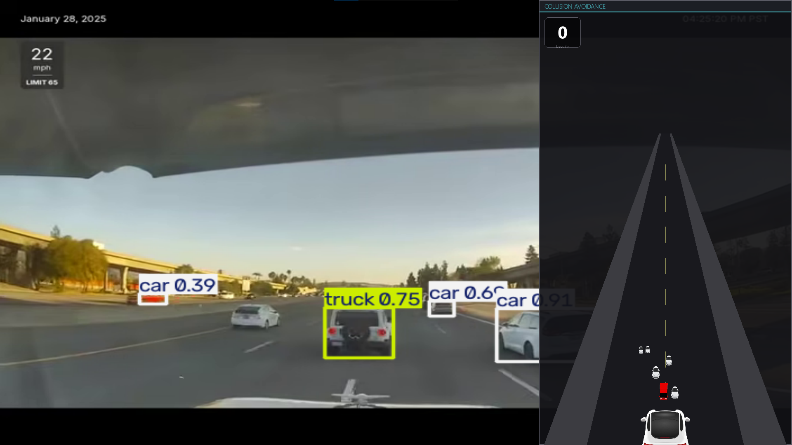

# driveR

A monocular driver-assistance prototype  - real-time object detection, tracking,
time-to-collision risk assessment, and a live bird's-eye-view HUD - without
LIDAR or stereo cameras



**Status: core pipeline working end-to-end on PC (video/webcam), full icon
set in place, real risk-level tinting and warning badges wired to a tested
C++ risk engine.
## Architecture

```
driveR/
├── main.py                    # orchestrator - wires everything 
├── calibration_tool.py        # one-time setup: a real homography
├── perf_probe.py              # optional p
├── homography.npy             # generated by calibration_tool.py 
├── risk_engine_cpp.*.so/.pyd  # compiled from risk_engine_src/
├── requirements.txt
├── assets/icons/              # CC0 assets 
├── docs/                      # screenshots for this README
├── risk_engine_src/           # C++ source for the risk engine
│   ├── risk_engine.cpp
│   └── setup.py
├── perception/                  # "what am I looking at, and where is it really"
│   ├── Detector.py               #   pixels -> (class, confidence, bbox)
│   ├── BEVtransform.py           #   bbox -> real-world (x_lateral, z_forward) meters
│   ├── tracker.py                #   detections -> persistent track_id 
│   ├── risk_manager.py           #   tracked objects -> closing_speed/ttc/risk_level,calls risk engine
│   ├── frame_sources.py          #   video file / webcam / picamera / CARLA, in one  interface
│   └── world_point.py            #   small vector type for track/risk math
└── visualization/                # "how do I draw what perception figured out"
    ├── icon_map.py                #   class_id -> sprite path, per-class sizing, warning badge config
    └── HUD.py                     #   world coordinates + risk_level -> pixels on screen
```


## What works today

- YOLO-based detection: cars, people, motorcycles, buses, trucks, traffic
  lights, stop signs - full icon set for all classes now in place
- Ground-plane homography converts each detection's bounding box into a
  real-world (lateral offset, forward distance) estimate in meters
- Persistent object tracking (deep_sort_realtime) - stable track_id across
  frames instead of independent per-frame detections
- Real time-to-collision: a small, deliberately simple C++ risk engine
  (closing speed + TTC from two distance sample
- Pygame top-down HUD: road-perspective background, per-class icon sizing,
  distance-based scaling, depth-sorted draw order, pixel-only decluttering
- One-time interactive camera calibration tool
- Frame source abstraction (video file / webcam / Pi camera / CARLA) behind
  one shared interface - switching source is a `--source` flag


## Known limitations (current, not aspirational)

- Distances are only as good as your calibration - falls back to an
  uncalibrated placeholder (with a loud warning) if `homography.npy` isn't
  present. **This is also what determines how accurate detected objects'
  positions look on the HUD** - with the placeholder homography, icon
  position/distance is a rough guess, not ground truth. See "Calibrating
  for your camera" below; run it once per camera mounting.
- Risk TTC thresholds are fixed constants, not scaled by speed
- No lateral-trajectory awareness yet - a car closing distance in an
  adjacent lane reads the same as one merging into your lane
- `speed_kmh` shown on the HUD is not wired to a real speed source yet -
  it's always 0 unless you pass something into `hud.render(..., speed_kmh=...)`
  yourself


## Setup

```bash
pip install -r requirements.txt

cd risk_engine_src
pip install pybind11 setuptools
python setup.py build_ext --inplace
# copy the resulting risk_engine_cpp.*.so (Linux) or .pyd (Windows) up to
# the project root - it must be importable from wherever main.py runs

cd ..
python main.py                            # default: reads Datasets/test.mov
python main.py --source webcam            # live camera
python main.py --source carla             # needs a running CARLA server, see below
python main.py --hud-mode panel           # single window: HUD panel over the live feed
python main.py --hud-mode panel --panel-side left
python main.py --debug-risk               # print each track's (risk_level, ttc) once/sec
```

### HUD modes

- `--hud-mode standalone` (default): two windows - a plain `cv2.imshow`
  "Raw detections" window with YOLO's own box/label overlay, and a
  full-window pygame top-down HUD.
- `--hud-mode panel`: one window. The annotated detection frame is drawn as
  the pygame window's background, and the top-down HUD is confined to an
  opaque panel along one edge (`--panel-side left|right`, default `right`)
  sitting on top of it.

## Calibrating for your camera

```bash
python calibration_tool.py path/to/calibration_frame.jpg
```
Click 4+ points on the ground plane whose real-world position you've
measured, enter each one's real `(x_lateral, z_forward)` in meters when
prompted. Saves `homography.npy`, auto-loaded by `main.py` next run.

## Roadmap

- [ ] Verify `risk_level` escalation on real driving footage
- [ ] Speed-scaled TTC thresholds
- [ ] Lateral-trajectory awareness in risk_manager (merge detection)
- [ ] Verify `CarlaFrameSource` against a live server; ground-truth distance
      validation
- [ ] Traffic sign dataset fine-tuning (GTSDB or Mapillary Traffic Sign
      Dataset)
- [ ] Monocular depth estimation (pseudo-LiDAR style)
- [ ] Raspberry Pi deployment - NCNN export, on-device benchmarking (re-run
      perf_probe there specifically), camera

## Hardware target (planned, not yet built)

Raspberry Pi + camera module + small HUD screen 
mounted on the windshield.

## Disclaimer

This is a research/portfolio prototype, not a certified safety system.
Never rely on it while actually driving.
